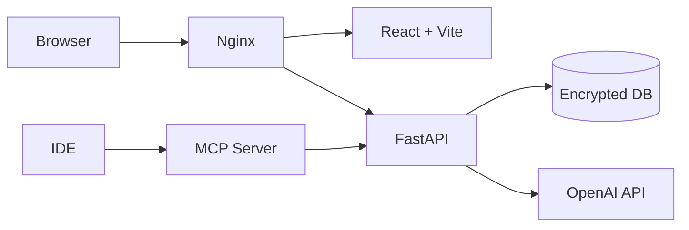

# ZeroWhisper

Self-hosted personal finance manager with encrypted storage and AI-powered expense entry.

## Features

- Encrypted SQLite database (SQLCipher — unreadable without your key)
- Dual-currency transactions (JOD + USD with exchange rate tracking)
- Natural language expense entry via "Whisper" AI agent (OpenAI)
- CSV import with automatic bank format detection
- Interactive dashboards: cash flow, Sankey diagram, burn-rate heatmap, net worth trend
- MCP server for querying your finances from Cursor/Claude Desktop
- First-run setup wizard with BIP39 recovery phrase
- JWT authentication

## Architecture



## Quick Start

Prerequisites: Docker, Docker Compose, an OpenAI API key.

```bash
git clone <repo>
cd ZeroWhisper
cp .env.example .env
# Edit .env: set OPENAI_API_KEY and JWT_SECRET
make prod
# Open http://localhost
```

On first run, the browser opens a setup wizard. Set a database passphrase, then save the 24-word BIP39 recovery phrase somewhere safe (shown once only). After that, register your account and start adding transactions.

## Development

```bash
make dev        # Start with hot-reload (backend port 8000, frontend port 5173)
make test       # Run backend pytest suite
make logs       # Tail service logs
make backup     # Backup encrypted DB
```

Running services directly:

```bash
# Backend
cd backend && uvicorn app.main:app --reload

# Frontend
cd frontend && npm run dev

# Alembic migrations
cd backend && alembic upgrade head
```

## API Documentation

When the server is running, visit `http://localhost:8000/docs` for the interactive Swagger UI.

Main endpoint groups:

| Prefix | Description |
|---|---|
| `/setup` | First-run wizard |
| `/auth` | Login and token refresh |
| `/api/transactions` | Create, list, update, delete transactions |
| `/api/imports` | CSV import |
| `/api/exchange-rates` | JOD/USD rate management |
| `/api/api-keys` | API key management |
| `/api/whisper` | Natural language expense entry |
| `/api/analytics` | Spending breakdowns and trends |
| `/api/dashboard` | Dashboard data |
| `/mcp` | MCP server endpoint |

## MCP Integration

Generate an API key in Settings → API Keys, then add the server to Cursor (`~/.cursor/mcp.json`) or Claude Desktop:

```json
{
  "mcpServers": {
    "zerowhisper": {
      "url": "http://localhost/mcp",
      "headers": { "X-API-Key": "zwp_your_key_here" }
    }
  }
}
```

Available tools: `get_balance`, `get_recent_transactions`, `get_spending_by_category`, `get_net_worth`

Available resources: `zerowhisper://balance`, `zerowhisper://transactions/recent`, `zerowhisper://transactions/by-category`, `zerowhisper://net-worth`

## Security

- The database is encrypted with AES-256 via SQLCipher. Running `sqlite3 data/zerowhisper.db` will show "file is not a database".
- The encryption key is derived via PBKDF2-SHA256 (260,000 iterations) and held only in memory — never written to disk, environment files, or logs.
- The 24-word BIP39 recovery phrase is shown once at setup. Back it up offline.
- `JWT_SECRET` should be a random 32-byte hex string. Generate one with:
  ```bash
  python -c "import secrets; print(secrets.token_hex(32))"
  ```

## Environment Variables

| Variable | Default | Description |
|---|---|---|
| `OPENAI_API_KEY` | (required) | OpenAI API key for Whisper agent |
| `WHISPER_MODEL` | `gpt-4o-mini` | OpenAI model to use |
| `JWT_SECRET` | (required in prod) | JWT signing secret (32+ random chars) |
| `AUTO_FETCH_EXCHANGE_RATE` | `false` | Auto-fetch JOD/USD rate from Frankfurter API |
| `DEFAULT_EXCHANGE_RATE` | `0.709` | Fallback JOD per USD if no rate is set |
| `LOG_LEVEL` | `INFO` | Logging level |

See `.env.example` for the full list including optional variables.

## Tech Stack

- **Backend**: Python 3.12, FastAPI, SQLModel, pysqlcipher3, Alembic, python-jose, passlib
- **Frontend**: React 19, TypeScript, Vite, Tailwind CSS v4, Shadcn UI, Recharts
- **Infrastructure**: Docker, nginx, docker-compose
